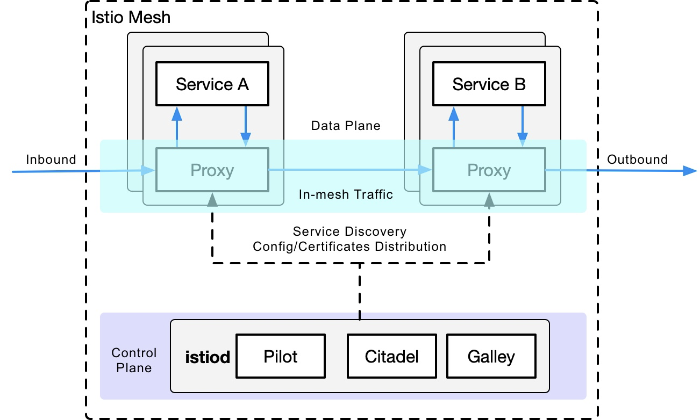
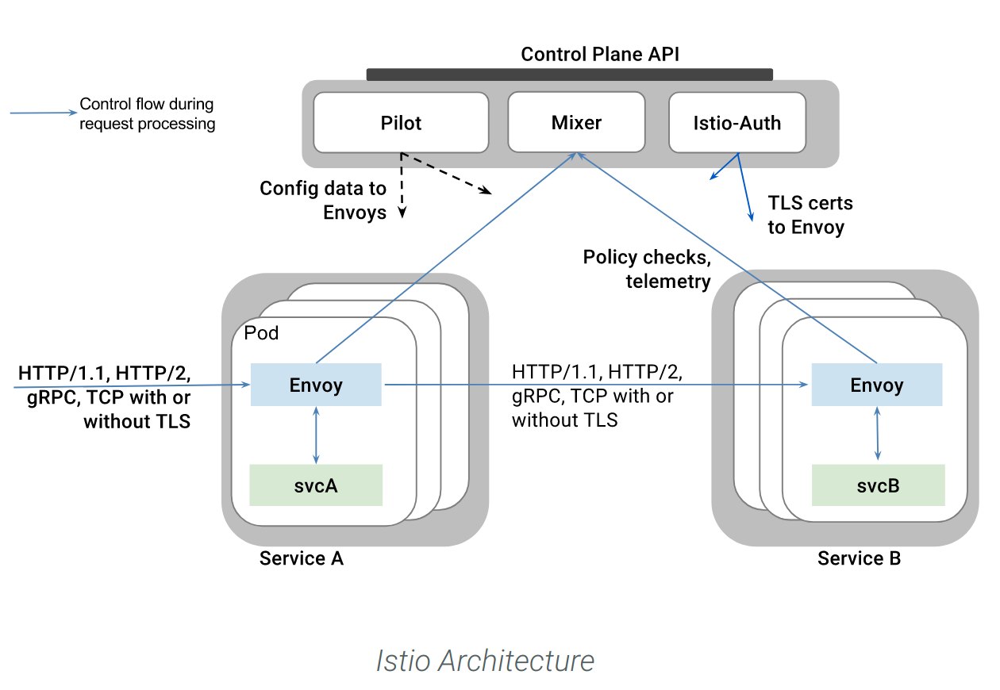
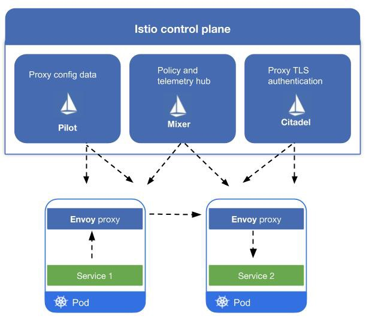
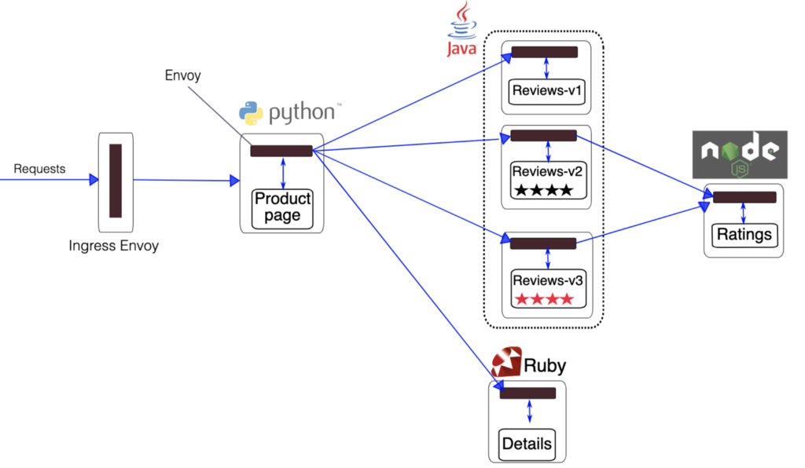

# Application

<!---

-->

## Presentation Slides

## System Architecture Diagram

## Funtional Hierarchy Diagram

## Context Diagram

## Component Diagram

## ER Diagram

## Software Level Architecture Diagram

## State Diagram

## Sequence Diagram

## Deployment Diagram

## Use Case Diagram

